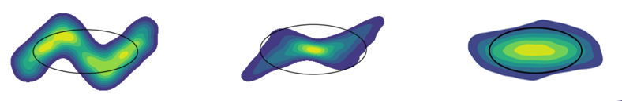

# EasyGDF ⚡
[](https://pypi.org/pypi/easygdf/)
[](https://anaconda.org/conda-forge/easygdf)
[](https://pypi.org/pypi/easygdf/)
[](https://pypi.org/pypi/easygdf/)



EasyGDF is a python library that simplifies the loading and saving of general datafile format (GDF) files used in the
particle accelerator simulation code [General Particle Tracer (GPT)](http://www.pulsar.nl/gpt/).  

## How to Install
Find us on PyPI! 😀
```
pip install easygdf
```
Also available on [conda-forge](https://conda-forge.org/)!  Add the channel by following the instructions on their website and then install easygdf.
```
conda install easygdf
```

## Quickstart
Let's look at a minimal example of reading and writing GDF files.  GDF files are organized into blocks which each have a
name, a value, and possibly some children.  The children are also blocks.
```python
import easygdf
import numpy as np

# Let's write an example file with a variety of data types
blocks = [
    {"name": "an array", "value": np.array([0, 1, 2, 3])},
    {"name": "a string", "value": "Hello world!"},
    {"name": "a group", "value": 3.14, "children": [{"name": "child", "value": 1.0}]}
]
easygdf.save("minimal.gdf", blocks)

# Now we'll read it back and print out some info about each block
d = easygdf.load("minimal.gdf")
for b in d["blocks"]:
    print("name='{0}'; value='{1}'; n_children={2}".format(b["name"], b["value"], len(b["children"])))
```
EasyGDF returns data as python/numpy native data types.  The file is returned as a dictionary containing all elements of
the file header as well as the data itself.  The blocks show up as a list under the key `blocks` in the returned dict.
Every block contains the same three keys: `name`, `value`, and `children`.  Children is a python list of blocks itself.
This format (GDF file being returned as a dict) is meant to be fully compatible with the corresponding GDF save
function.  This makes quick modification of GDF files simple.
```python
import easygdf

d = easygdf.load("your_file.gdf")
# Modify the data in "d" here
easygdf.save("modified_file.gdf", **d)
```

When we're dealing with the output of GPT directly and not an abstract GDF file, we don't need to deal with raw blocks and can rely on easyGDF to return the data in a
cleaner format.  Let's try using one of the convenience functions for this task.
```python
import easygdf

# Pull out an example screen/tout file from easygdf
filename = easygdf.get_example_screen_tout_filename()

# Load it and print the number of screens and time outs
d = easygdf.load_screens_touts(filename)
print("n_screens: {0}".format(len(d["screens"])))
print("n_touts: {0}".format(len(d["touts"])))

# Let's print some data from the first screen in the file
screen = d["screens"][0]
print("x: {0}".format(screen["x"]))
print("Bx: {0}".format(screen["Bx"]))
print("m: {0}".format(screen["m"]))
```
All data is again returned as a dictionary with the screens and touts showing up as lists of dictionaries under the
corresponding keys.

Another common use of GDF files is in specifying initial particle distributions for GPT.  Let's take a look at using the
library's function for this task.
```python
import easygdf
import numpy as np

# Save some data to an initial distribution file.  Unspecified required values are autofilled for us
easygdf.save_initial_distribution(
    "initial.gdf",
    x=np.random.normal(size=(3,)),
    GBx=np.random.normal(size=(3,)),
    t=np.random.random((3,)),
)
```
You may notice, that we haven't specified all required particle parameters for GPT.  Don't worry, EasyGDF will autofill
those values with zeros for you to produce a valid output.  Certain parameters (such as if you don't manually set `ID`)
will be filled with appropriate non-zero values ([1,2,3,4,...] in this case).

## Testing
This project uses the `unittest` framework. Please run the tests in this project by running the following command at the
root of this repository.
```
$ python -m unittest
```
If you are contributing to the library (Thank you!) please make sure your PR passes the full test suite.  In addition,
please add unit tests during bugfixes that will fail on the bug being repaired.  For feature additions please add test
cases as reasonable.

## Reporting Issues and Contributing
Errors are tracked on [our github page](https://github.com/electronsandstuff/easygdf).  Please report your
problems/feature requests there with as much detail as possible.  Contributions are always welcome.  Please open an
issue on github and start a discussion there before working on a PR.  Thanks!

## Package Reference
### load(f, ...)
All data in GDF file is loaded into python dictionary.  Dict will have the following keys which include the data
blocks as well as information from the file's header.
 * creation_time: datetime object
 * creator: string
 * destination: string
 * gdf_version: tuple (int, int)
 * creator_version: tuple (int, int)
 * destination_version: tuple (int, int)
 * dummy: tuple (int, int)
 * blocks: list of block dictionaries (see following description)

The main section of the file shows up in "blocks" which is a list of each hierarchical name-value pair.  Blocks are
returned as python dicts with the keys: `name`, `value`, `children`.  The contents of `children` is itself a list of
blocks with the same format.  Array values in the GDF file are populated into numpy arrays of the correct data type.

##### Parameters
 * f: filename or open file/stream-like object
 * max_recurse (default: 16): Maximum recursion depth while loading blocks in GDF file
 * max_block (default: 1e6): Maximum number of blocks that will be read in each GDF group

##### Returns
Dictionary of GDF data (see description)

### save(f, blocks=None, ...)
Saves user provided data into a GDF file.  Blocks is a list of python dicts with the keys: `name`, `value`, `children`.  Name must
be a string that may be encoded as ASCII.  Values may be an int, a float, a string, None, a bytes object, or a numpy
array.  Most numpy data types are supported except for complex types.  The contents of "children" is
itself a list of blocks with the same format.

Function signature is fully compatible with load function to simplify the following example of editing a GDF file:
```python
import easygdf

d = easygdf.load("your_file.gdf")
# Modify the data in "d" here
easygdf.save("modified_file.gdf", **d)
```

##### Parameters
 * f: filename or open file/stream-like object
 * blocks (default: None): List of GDF blocks to be saved (see description)
 * creation_time (default: time when file is written): int/datetime object creation time written to header
 * creator (default: "easygdf"): string written to header
 * destination (default: ""): string written to header
 * gdf_version (default: (1, 1)): tuple (int, int) written to header.  (Don't change unless you like messing with low-level stuff)
 * creator_version (default: (2, 0)): tuple (int, int) written to header
 * destination_version (default: (0, 0)): tuple (int, int) written to header
 * dummy (default: (0, 0)): tuple (int, int) written to header
 * max_recurse (default: 16): Maximum recursion depth while saving blocks in GDF file

##### Returns
None

### load_screens_touts(f, ...)
Loads screens and touts from a GDF file and returns them in a more friendly dictionary.  Screens are in the list
"screens" and touts in the corresponding list "touts".  Root level parameters and header objects are returned in
the root of the dictionary.

##### Parameters
 * f: filename or open file/stream-like object
 * max_recurse (default: 16): Maximum recursion depth while loading blocks in GDF file
 * max_block (default: 1e6): Maximum number of blocks read from each GDF group

##### Returns
Dictionary with screens/touts and root level data

### save_screens_touts(f, screens=None, touts=None, ...)
Saves user data into a file with the format of a GPT output.  Signature is fully compatible with the output of the
corresponding load function.  Screens and touts are passed as a list of dicts with the following numpy arrays.

particle keys in tout: `x`, `y`, `z`, `Bx`, `By`, `Bz`, `m`, `q`, `nmacro`, `rmacro`, `ID`, `fEx`, `fEy`, `fEz`,
`fBx`, `fBy`, `fBz`, `G`, `rxy`

scatter keys in tout: `scat_x`, `scat_y`, `scat_z`, `scat_Qin`, `scat_Qout`, `scat_Qnet`, `scat_Ein`, `scat_Eout`,
`scat_Enet`, `scat_inp`

particle keys in screen: `ID`, `x`, `y`, `z`, `Bx`, `By`, `Bz`, `t`, `m`, `q`, `nmacro`, `rmacro`, `rxy`, `G`

Arrays don't need to be set in the dict if unused.  The missing keys will be automatically filled in with zeros to
the correct length.  In the case of redundant keys (such as `rxy`, `G`, or `ID`) values are computed from provided
data.  Scatter keys and particle keys in tout are handled separately in filling out array lengths (IE: if `x` was
set to an array of length 10, then `y` would be padded to that length in the output, but `scat_x` would remain
empty).  Any auxiliary keys in the dict will be saved to the screen/tout.

In addition to array elements, screen may contain the scalar "position" and tout can have the scalar "time" which
will be used as parameters for the groups.  Defaults are zero for each.

##### Parameters
 * f: filename or open file/stream-like object
 * screens (default: None): list of screen dicts
 * touts (default: None): list of tout dicts
 * logo (default: "B&M-General Particle Tracer"): string
 * scat_x (default: np.array([])): numpy array
 * scat_y (default: np.array([])): numpy array
 * scat_z (default: np.array([])): numpy array
 * scat_Qin (default: np.array([])): numpy array
 * scat_Qout (default: np.array([])): numpy array
 * scat_Qnet (default: np.array([])): numpy array
 * scat_Ein (default: np.array([])): numpy array
 * scat_Eout (default: np.array([])): numpy array
 * scat_Enet (default: np.array([])): numpy array
 * scat_inp (default: np.array([])): numpy array
 * numderivs (default: 0): int
 * cputime(default: 0.0): float
 * creation_time (default: current time): int/datetime object creation time written to header (default: time when file is written)
 * creator (default: "easygdf"): string written to header
 * destination (default: ""): string written to header
 * gdf_version (default: (1, 1)): tuple (int, int) written to header.  (Don't change unless you like messing with low-level stuff)
 * creator_version (default: (2, 0)): tuple (int, int) written to header
 * destination_version (default: (0, 0)): tuple (int, int) written to header
 * dummy (default: (0, 0)): tuple (int, int) written to header
 * max_recurse (default: 16): Maximum recursion depth while saving blocks in GDF file

##### Returns
None

### load_initial_distribution(f, ...)
Loads GPT initial distribution file into dict.  All arrays are loaded directly into the returned dict as well as the
GDF header.  See parameters in corresponding save function for list of all parameters.

##### Parameters
 * f: filename or open file/stream-like object
 * max_recurse (default: 16): Maximum recursion depth while loading blocks in GDF file
 * max_block (default: 1e6): Maximum number of blocks read from each GDF group

##### Returns
dict of initial distribution data

### save_initial_distribution(f, x=None, y=None, z=None, GBx=None, GBy=None, GBz=None, ...)
Saves GPT compatible initial distribution file.  All array objects must be the same length (IE the number of
particles).  If required values (either {`x`, `y`, `z`, `GBx`, `GBy`, `GBz`} or {`x`, `y`, `z`, `Bx`, `By`, `Bz`}) are
missing, easyGDF will autofill them with zeros.  Only specify the momentum or the velocity of particles, not both. Any
parameters no directly in the function's signature can be included as addition keyword arguments and will be added as
well.

##### Parameters
 * f: filename or open file/stream-like object
 * x (default: None): numpy array, particle position
 * y (default: None):numpy array, particle position
 * z (default: None):numpy array, particle position
 * GBx (default: None):numpy array, particle momentum
 * GBy (default: None):numpy array, particle momentum
 * GBz (default: None):numpy array, particle momentum
 * Bx (default: None):numpy array, particle velocity
 * By (default: None):numpy array, particle velocity
 * Bz (default: None):numpy array, particle velocity
 * t (default: None):numpy array, particle spawn time
 * G (default: None):numpy array, Lorentz factor
 * m (default: None):numpy array, particle mass
 * q (default: None):numpy array, particle charge
 * nmacro (default: None):numpy array, number of macroparticles
 * rmacro (default: None):numpy array, macroparticle size
 * ID (default: None):numpy array, macroparticle ID
 * creation_time (default: current time): int/datetime object creation time written to header (default: time when file is written)
 * creator (default: "easygdf"): string written to header
 * destination (default: ""): string written to header
 * gdf_version (default: (1, 1)): tuple (int, int) written to header.  (Don't change unless you like messing with low-level stuff)
 * creator_version (default: (2, 0)): tuple (int, int) written to header
 * destination_version (default: (0, 0)): tuple (int, int) written to header
 * dummy (default: (0, 0)): tuple (int, int) written to header
 * max_recurse (default: 16): Maximum recursion depth while saving blocks in GDF file

##### Returns
None
